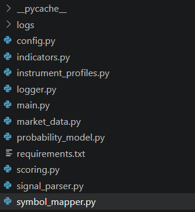
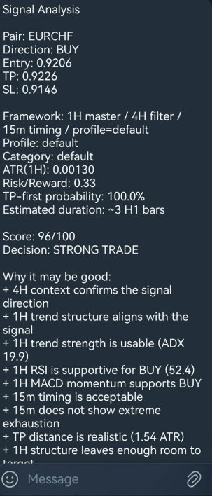

# TheSignalCraft

<p align="center">
  <b>Turning raw signals into reasoned decisions.</b>
</p>

<p align="center">
  A modular Python project for evaluating trading signals through technical analysis, scoring logic, and probability-based decision support.
</p>

<p align="center">
  
  
  
  
  
  
  
  
</p>

---

## Overview

**TheSignalCraft** is a modular project designed to evaluate manually submitted trading signals.

The system does not execute trades automatically. Instead, it:
- retrieves market data  
- applies technical indicators  
- evaluates the signal using a scoring model  
- estimates the probability of TP being reached before SL  
- returns a structured decision  

---

## Screenshots

### Signal analysis


### Project structure


### Bot interaction


---

## Key Features

- 📊 Multi-timeframe market analysis  
- 📈 Technical indicators (EMA, RSI, MACD, ATR, ADX, Bollinger Bands)  
- 🧠 Signal scoring system  
- 🎯 Probability model (TP vs SL)  
- ⏱️ Trade duration estimation  
- 🗂️ Result logging (CSV + SQLite)  
- ⚙️ Modular architecture  

---

## 🔄 Processing Flow

```text
Signal Input
     ↓
Parsing (signal_parser)
     ↓
Market Data (yfinance)
     ↓
Indicators (EMA, RSI, MACD, ATR, ADX)
     ↓
Scoring Engine
     ↓
Probability Model
     ↓
Final Decision
     ↓
Logging
```

---

## Decision Model

Signals are classified into:

- REJECT  
- RISKY  
- ACCEPT  
- STRONG TRADE  

---

## Project Structure

```text
TheSignalCraft/
├── app/
│   ├── main.py
│   ├── config.py
│   ├── indicators.py
│   ├── instrument_profiles.py
│   ├── logger.py
│   ├── market_data.py
│   ├── probability_model.py
│   ├── scoring.py
│   ├── signal_parser.py
│   └── symbol_mapper.py
├── screenshots/
│   ├── screenshot-1.png
│   ├── screenshot-2.png
│   └── screenshot-3.png
├── tests/
│   ├── test_instrument_profiles.py
│   ├── test_main_flow.py
│   ├── test_probability_model.py
│   ├── test_scoring.py
│   ├── test_signal_parser.py
│   ├── test_symbol_mapper.py
│   └── READMe.md
├── docs/
│   ├── architecture.md
│   ├── workflow.md
│   ├── modules.md
│   ├── testing.md
│   ├── configuration.md
│   ├── limitations.md
│   └── READMe.md
├── .env.example
├── .gitignore
├── README.md
└── requirements.txt
```
---

## Documentation

For a more detailed technical breakdown of the project, see the documentation below:

- [Documentation Overview](docs/README.md)
- [System Architecture](docs/architecture.md)
- [Processing Workflow](docs/workflow.md)
- [Module Reference](docs/modules.md)
- [Testing Strategy](docs/testing.md)
- [Configuration Guide](docs/configuration.md)
- [Known Limitations](docs/limitations.md)

---

## 🧪 Example Analysis

**Input:**

```text
/signal GBPUSD BUY 1.2750 1.2820 1.2700
```

**Analysis:**

- Trend: bullish  
- Momentum: positive  
- RSI: within normal range  
- ADX: strong trend  
- Risk/Reward: acceptable  

**Result:**
```
Score: 72/100
Decision: ACCEPT
Probability: 61.5%
Estimated Duration: ~5 H1 candles
```

---

## Installation

```bash
git clone https://github.com/KristiyanGeorgiev1996/TheSignalCraft.git
cd TheSignalCraft
pip install -r requirements.txt
```

---

## Configuration

Create a `.env` file:

```env
TELEGRAM_TOKEN=your_telegram_bot_token_here
```

---

## Run

```bash
python main.py
```

---

## Principles

- Modularity  
- Transparency  
- Practicality  
- Risk awareness  

---

## Limitations

- Does not execute trades  
- Does not guarantee profit  
- Uses a heuristic probability model  

---

## License

MIT License  

---

## Disclaimer

This project is intended for educational purposes only.  
It does not provide financial advice.
